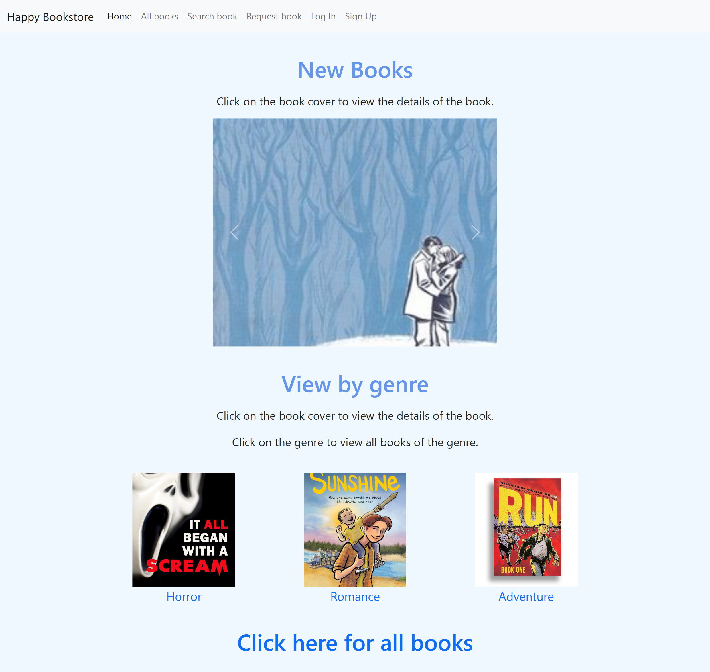

# Bookstore Database Management System using Python & Django

This is our team's d3.js project for our 2022 Database Systems class at Peking University.

For a brief summary report of the DBMS, you may refer to "A Brief Summary Report of the Database Management System.pdf" (the report is in Chinese, the attached guides in the same pdf are in English)

## A basic introduction for the folders and files:

* bookstore
    * __init__.py: django-generated file to recognise that this is an app
    * asgi.py: django-generated file
    * settings.py: django-generated file; can be edited to specify database settings etc.
    * urls.py: django-generated file; edited to specify urls
    * wsgi.py: django-generated file
* books
    * templates/books: html templates
    * __init__.py: django-generated file to recognise that this is an app
    * admin.py: django-generated file
    * apps.py: django-generated file
    * forms.py: file for form classes
    * models.py: django-generated file; written with database models to specify the fields stored in database
    * tests.py: django-generated file for tests
    * urls.py: django-generated file; written to specify the urls of the pages
    * views.py: django-generated file; written to define the functions to select data from database and display them on the html pages
* comments
* main
* orders
* requestedbook
* users

P.S. comments, main, orders, requestedbook, users have the similar folder structure as books because they are all django apps.

## Examples:

Updated: 18th July 2023
